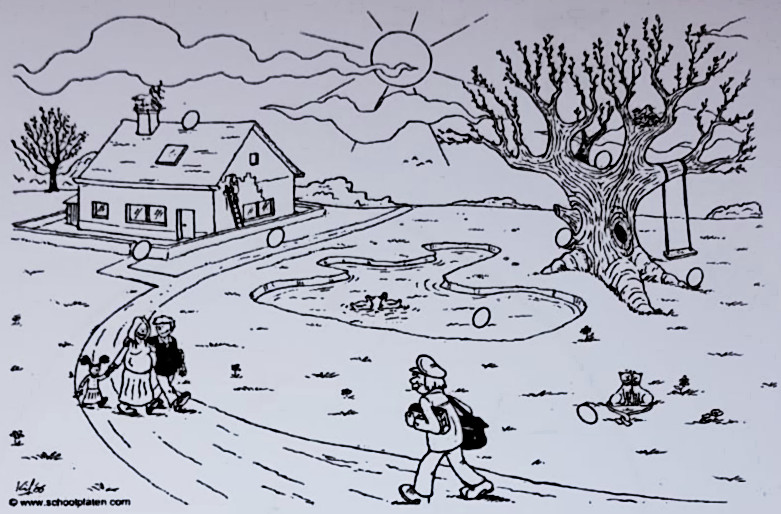
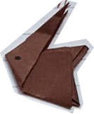

<!--
author:   André Dietrich

email:    LiaScript@web.de

version:  0.0.1

language: de

narrator: Deutsch Female

mode: Textbook

-->

# Aufgaben

Hallo, liebe Kinder!
Das sind die Aufgaben für die Woche vom 30.3. - 3.04.2020.
Danach habt ihr Ferien

--------------------------------------

___Lesen:___

* Lehrbuch Seite 114 - 117
* AB [Sinnerfassung](#Sinnerfassung)
* Meine Geschichte für euch

--------------------------------------

___Sprache:___

* AB Wortbausteine
* AB Mein Oster-ABC
* Sp.-Buch Seite 78 Nr. 1,2
* Sp.-Buch Seite 79 Nr. 1 mündlich

--------------------------------------

___Rechtschreibung:___

~~Wörter mit ng~~

* Sp.-Buch Seite 81 Nr. 2-4
* Arbeitsheft Seite  40 bearbeiten

--------------------------------------

___Sachunterricht:___

* Lesebuch Seite 120
* Schreibe eine Steckbrief vom Rotkehlchen!
* Male das Rotkehlchen aus.

  !?[Rotkehlchen](https://www.youtube.com/watch?v=Domnjqunms4)

* Vielleicht kannst du ein Rotkehlchen beobachten.


## Mathematik

Lerne die Malfolge der 5! Male die Malfolge mit Würfelbildern in dein Heft.

<!-- style="max-width: 500px" -->
```````````````````````````
+-------+
| o   o |
|   o   |                       1 • 5 = 5
| o   o |
+-------+

+-------+ +-------+
| o   o | | o   o |
|   o   | |   o   |             2 • 5 = 10
| o   o | | o   o |
+-------+ +-------+

+-------+ +-------+ +-------+
| o   o | | o   o | | o   o |
|   o   | |   o   | |   o   |   3 • 5 = 15
| o   o | | o   o | | o   o |        .
+-------+ +-------+ +-------+        .
              .                      .
              .                      .
```````````````````````````


Wieviel ist dann am Ende 10 • 5?
Trage das richige Ergebnis bitte in das Textfeld ein.

    [[50]]

### Weitere Aufgaben

* AB "Domino mit 5"
* Such- und Anmalblatt
* Hausaufgaben
* AB Geometrie

> Liebe Eltern (Vertretungslehrer), bitte entscheiden Sie, ob Ihr Kind alle Aufgaben schaffen kann.
> Ich bedanke mich ganz herzlich für Ihre Unterstützung! Bleiben Sie schön gesund!
>
> _P. Muchow_


## Sinnerfassung


<!-- style="width: 100%" -->


Der Osterhase war sehr fleißig.
Er hat viele Eier versteckt.
Hilf Susi und Erich alle zu finden.
Male die Eier in der richtigen Farbe an.

Auf dem Baum liegt ein rotes Ei.
Der Hase hat das gelbe Ei unter der Schaukel versteckt.
Susi entdeckt das grüne Ei auf dem Dach.
Das rosa Ei kuller neben den Katzen.
Im Teich schwimmt ein braunes Ei.
Das blaue Ei findet Erich zwischen der Mauer.
„Vor dem Haus ist ein violettes Ei!”, schreit das Mädchen.
Nur das goldene Ei auf der Wiese hinter dem Baus wird nicht gefunden.
Hast du es entdeckt?


[^Quelle]: http://www.scholplate.com verändert (Windisch Petra 3/2010)

## <span style="color: green">Meine</span> Geschichte <span style="color:orange">für</span> <span style="color:blue">euch</span>

    --{{0}}--
Lexi, Mimi und Mo wollen den Osterhasen suchen.
Zuerst schauen Sie in alle Schränke im Klassenzimmer.
Nun durchsuchen sie die Bänke.
Aber alles ohne Erfolg.
Traurig setzen sich die drei Freunde in die Leseecke.
„Da!”, ruft Mo.

    {{1}}


    --{{1}}--
Mimi holt aus dem linken unteren Fach einen gefalteten Hasen heraus.
„Den haben die Kinder gebastelt”, sagt Lexi.
Plötzlich beginnt der Hase zu sprechen.

    --{{2 Deutsch Male}}--
„Mimi, Mo, Lexi ihr müsst los.
Die Kinder der 2 a haben doch für euch Ostereier versteckt."

    --{{3}}--
Die Freunde sehen sich erstant an.
„Seit wann können gefaltete Hasen reden?”, fragt sich Lexi.
Da sagt der Hase.


## Einmaleinstafel


<!-- style="width:100%; max-width: 400px" -->
